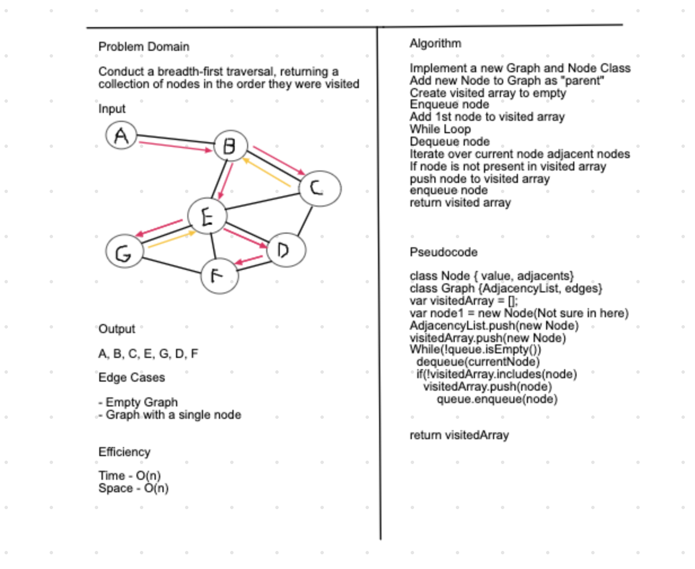

# Data Structures & Algorithms
#### Author: Cas Ibrahim

*** 
*** 

### Algorithms
##### Blog
* [Sort Blog](algorithms/BLOG.md)

##### Code
* [insertionSort](algorithms/insertionSort/insertion-sort.js)
* [mergeSort](algorithms/mergeSort/merge-sort.js)
* [quickSort](algorithms/quickSort/quick-sort.js)

*** 
***

### Data Structures

* [linkedList](data-structures/linkedList/linked-list.js)
* [linkedListZip](data-structures/llZip/ll-zip.js)
* [stacksAndQueues](data-structures/stacksAndQueues/stacks-and-queues.js)
* [queueWithStacks](data-structures/queueWithStacks/queue-with-stacks.js)
* [fifoAnimalShelter](data-structures/fifoAnimalShelter/fifo-animal-shelter.js)
* [tree](data-structures/tree/tree.js)
* [hashtable](data-structures/hashtable/hashtable.js)
* [graph](data-structures/graph/graph.js)

*** 
*** 

#### 1.0 Singly Linked List (insert, includes, toString)
Code Challenge: Class 05

##### Challenge
* Create a Node class that has properties for the value stored in the Node, and a pointer to the next Node.
* Within your LinkedList class, include a head property. Upon instantiation, an empty Linked List should be created.
    * Define a method called insert which takes any value as an argument and adds a new node with that value to the head of the list with an O(1) Time performance.
    * Define a method called includes which takes any value as an argument and returns a boolean result depending on whether that value exists as a Node’s value somewhere within the list.
    * Define a method called toString which takes in no arguments and returns a string representing all the values in the Linked List, formatted as: 
    `{ a } -> { b } -> { c } -> NULL`

##### API
* insert(value)
    * takes in any value
    * adds a new node with that value to the head of the list
* includes(value)
    * takes in any value and returns a boolean
    * returns true if value exists in the linked list
    * returns false if value does not exist in the linked list
* toString()
    * takes in no arguments
    * returns a string representing all the values in the linked list
    
*** 

#### 1.1 Singly Linked List (append, insertBefore, insertAfter)
Code Challenge: Class 06

##### Challenge
* Within your LinkedList class, add the following methods:
    * append(value) which adds a new note with the given val to the end of the linked list
    * insertBefore(value, newValue) which adds a new note with the given newValue immediately before the node with the existing value
    * insertAfter(value, newValue), which adds a new node with the given newValue immediately after the node with the existing value

##### API
* append(value)
    * takes in any value
    * adds a new node with that value to the end of the list
* insertBefore(value, newValue)
    * takes in an existing value and a new value
    * adds a new node with the new value to the linked list, directly before the node with the existing value
* insertAfter(value, newValue)
    * takes in an existing value and a new value
    * adds a new node with the new value to the linked list, directly after the node with the existing value

##### Solution


***

#### 1.2 Singly Linked List (kthFromEnd)
Code Challenge: Class 07

##### Challenge
* Within your LinkedList class, add method kthFromEnd which takes a number (k) as a parameter, Return the node's value that is k from the end of the linked list.

##### API
* kthFromEnd(k)
    * takes in any integer
    * return the value of the node that is in the kth position from the end of the list

##### Solution


***

#### 2.0 Zip Two Linked Lists
Code Challenge: Class 08

##### Challenge
* Write a function which takes two linked lists as arguments. Zip the two linked lists together into one so that the nodes alternate between the two lists and return a reference to the head of the zipped list. 

##### Solution

    
*** 

#### 3.0 Stacks and Queues
Code Challenge: Class 10

##### Challenge
* Create a Node class that has properties for the value stored in the Node, and a pointer to the next node.
* Create a Stack class that has a top property. It creates an empty Stack when instantiated. Add functionality to add and remove values from the stack, view the top node in the stack, and check whether the stack is empty. 
* Create a Queue class that has a front property. It creates an empty Queue when instantiated. Add functionality to add and remove values from the queue, view the front node in the queue, and check whether the queue is empty.


##### API
* Stack
    * push(value)
        * takes any value as an argument, adds a new node with that value to the top of the stack
    * pop()
        * takes in no arguments, removes the node at the top of the stack and returns the popped node's value
        * raises an exception when called on an empty stack
    * peek()
        * takes in no arguments, returns the value of the node located on the top of the stack
        * raises an exception when called on an empty stack
    * isEmpty()
        * takes in no arguments, returns true if the stack is empty, returns false if the stack is not empty
* Queue
    * enqueue(value)
        * takes any value as an argument, adds a new node with that value to the queue 
            * if the queue contains no values, the front and the rear pointers are pointing at the new node
            * if the queue contains an existing value, the new node is added to the rear of the queue 
    * dequeue()
        * takes in no arguments, removes the node at the front of the queue and returns the dequeued node's value
        * raises an exception when called on an empty queue
    * peek()
        * takes in no arguments, returns the value of the node located on the front of the queue
        * raises an exception when called on an empty queue
    * isEmpty()
        * takes in no arguments, returns true if the queue is empty, returns false if the queue is not empty

***

#### 4.0 Queues with Stacks
Code Challenge: Class 11

##### Challenge
* Create a PseudoQueue class which:
    * utilizes 2 Stack objects
    * contains an enqueue method and a dequeue method

##### API
* PseudoQueue
    * enqueue(value)
        * takes any value as an argument, adds a new node with that value to the top of the stack/front of the queue
    * dequeue()
        * takes in no arguments, removes nodes from the top of the stack until the stack is empty, pushing them into a placeholder stack
        * returns the value of the node at the top of the stack when all nodes from stack 1 have been pushed to the placeholder stack (stack 2)

##### Solution


*** 

#### 5.0 First-in, First-out Animal Shelter
Code Challenge: Class 12

##### Challenge
* Create a class called AnimalShelter which holds only dogs and cats. The shelter operates using a first-in, first-out approach and includes the following methods:
    * enqueue(animal)
    * dequeue(pref)

##### API
* enqueue(animal)
    * adds animal to the shelter
    * animal may be either a dog or a cat object
* dequeue(pref)
    * takes in an animal type preference
    * returns either a dog or a cat, depending on the value of pref
    * if pref is neither dog nor cat, null is returned

##### Solution


*** 

#### 6.0 Binary Tree and BST Implementation
Code Challenge: Class 15

##### Challenge
* Create a Node Class that has properties for the value stored in the node, the left child node, and the right child node
* Create a Binary Tree Class with methods that enable pre-order, in-order, and post-order traversal
* Create a Binary Search Tree Class with methods that enable the addition of a new node in the correct position as well as searching for the presence of a value within the binary search tree

##### API
* Binary Tree
    * preOrder() 
        * accepts no argument
        * traverses the tree from root->left->right and returns a properly ordered array filled with the values stored in the nodes
    * inOrder()
        * accepts no arguments
        * traverses the tree from left->root->right and returns a properly ordered array filled with the values stored in the nodes
    * postOrder()
        * accepts no arguments
        * traverses the tree from left->right->root and returns a properly ordered array filled with the values stored in the nodes

* Binary Search Tree
    * add(value)
        * accepts a value as an argument
        * adds a node with that value to the proper place on the binary search tree
    * contains(value)
        * accepts a value as an argument
        * performs a binary search on the tree
            * returns true if the value is present in the tree at least once
            * returns false if the value is not present in the tree

*** 

#### 6.1 Find Maximum Value in Binary Tree
Code Challenge: Class 16

##### Challenge
* Create an instance method (within class Binary Tree) that finds the maximum value stored within the tree

##### API
* findMaximumValue()
    * takes no arguments
    * assumes all node values are integers
    * traverses the tree, comparing nodes in order to find the one with the highest value
    * returns the maximum value

##### Solution


*** 

#### 6.2 Traverse a Binary Tree Breadth-first
Code Challenge: Class 18

##### Challenge
* Write a breadth first traversal method which takes a Binary Tree as its unique input. Traverse the input tree using a Breadth-first approach, and return a list of the values in the tree in the order they were encountered.

##### API
* breadthFirst(tree)
    * takes a Binary Tree as its only argument
    * assumes all node values are integers
    * traverses the tree breadth first
    * pushes each value to a queue and dequeues to an array when appropriate
    * returns an array of properly-ordered values

##### Solution


*** 

#### 7.0 Implement Hashtable
Code Challenge: Class 30

##### Challenge
* Implement a Hashtable with the ability to add {key:value} pairs, retrieve values when given their associated key, check whether a key exists in the table, and create hashes & assign them to an index

##### API
* add(key, value)
    * takes in both the key and value
    * hashes the key
    * adds the key and value pair to the table
    * handles collisions as needed
* get(key)
    * takes in a key 
    * returns its associated value from the table
* contains(key)
    * takes in a key
    * returns a boolean indicating whether the key is already present in the table
* hash(key)
    * takes in an arbitrary key
    * returns the table index to be assigned to it

***

#### 8.0 Graphs
Code Challenge: Class 35

##### Challenge
* Implement a graph, represented as an adjacency list, with the abilities to add vertices, add edges, get a list of a vertex's adjacent vertices, get a list of all vertices in the graph, and get the size of the graph

##### API
* addVertex(value)
    * takes in a value
    * adds a vertex with that value to the graph
    * initializes its place in the graph's edges list with an object whose key is the vertex value and whose value is an empty array
    * returns the vertex
* addEdge(vertexA, vertexB)
    * takes in two vertices
    * adds vertexB to the array which is the value of vertexA's object in the graph's edges array
    * adds vertexA to the array which is the value of vertexB's object in the graph's edges array
    ```
    graph.edges = [
        { vertexA.value: [vertexB] },
        { vertexB.value: [vertexA] }
        ]
    ```
* getNeighbors(vertex)
    * takes in a vertex
    * returns a list of all vertices adjacent to the input vertex
* getVertices()
    * takes no arguments
    * returns a list of all vertices present in the graph
* getSize()
    * takes no arguments
    * returns an integer representing how many vertices are present in the graph

***

#### 8.1 Graphs - Breadth First Traversal
Code Challenge: Class 36

##### Challenge
* Implement breadth-first traversal on a graph

##### API
* breadthFirst(start)
    * takes in a vertex, called the start vertex
    * initializes an array in which to store vertices that have been traversed
    * initializes a new Queue (imported from [stacks-and-queues](data-structures/stacksAndQueues/stacks-and-queues.js))
    * enqueues the start vertex and pushes it to the array of traversed vertices
    * while the queue is not empty:
        * dequeue the front vertex
        * if the front vertex value has not been traversed, push it to the traversed array and enqueue it again
    * returns a list of all traversed vertices

##### Solution


***

#### 8.2 Graphs - Depth First Traversal
Code Challenge: Class 37

##### Challenge
* Implement depth-first traversal on a graph

##### API
* depthFirst(root)
    * takes in a vertex, called the root vertex
    * initializes an array in which to store vertices that have been traversed
    * initializes a new Stack (imported from [stacks-and-queues](data-structures/stacksAndQueues/stacks-and-queues.js))
    * pushes the root vertex into the stack and the array of traversed vertices
    * while the stack is not empty:
        * checks the top of the stack
            * if the top vertex's adjacent vertices have not been traversed:
                * pops the top vertex from the stack and pushes it into the array of traversed vertices
                * pushes the adjacent vertices into the stack
            * else pops the top vertex and repeats until empty
    * returns a list of all traversed vertices
***
*** 

### Code 301

* [for-each](code-challenges/301/for-each/challenges-01.test.js)
* [value-vs-reference](code-challenges/301/value-vs-reference/challenges-02.test.js)
* [sort](code-challenges/301/sort/challenges-03.test.js)
* [regex](code-challenges/301/regex/challenges-04.test.js)
* [chal5](code-challenges/301/chal5/challenges-05.test.js)
* [chal6](code-challenges/301/chal6/challenges-06.test.js)
* [map](code-challenges/301/map/challenges-07.test.js)
* [filter](code-challenges/301/filter/challenges-08.test.js)
* [reduce](code-challenges/301/reduce/challenges-09.test.js)
* [string](code-challenges/301/string/challenges-10.test.js)
* [regextwo](code-challenges/301/regextwo/challenges-11.test.js)
* [2d-arrays](code-challenges/301/2d-arrays/challenges-12.test.js)
* [includes](code-challenges/301/includes/challenges-13.test.js)
* [combo](code-challenges/301/combo/challenges-14.test.js)

*** 
*** 

### Code 401

* [arrayReverse](code-challenges/401/arrayReverse/array-reverse.js)
* [arrayShift](code-challenges/401/arrayShift/array-shift.js)
* [arrayBinarySearch](code-challenges/401/arrayBinarySearch/array-binary-search.js)
* [multiBracketValidation](code-challenges/401/multiBracketValidation/multi-bracket-validation.js)
* [fizzBuzzTree](code-challenges/401/fizzBuzzTree/fizzbuzz-tree.js)
* [repeatedWord](code-challenges/401/repeatedWord/repeated-word.js)
* [treeIntersection](code-challenges/401/treeIntersection/tree-intersection.js)
* [getEdges](code-challenges/401/getEdges/getedges.js)

*** 
*** 

#### 1. Reverse an Array (arrayReverse)
Code Challenge: Class 01

##### Challenge
Write a function called reverseArray which takes an array as an argument. Without utilizing any of the built-in methods available to your language, return an array with elements in reversed order.

##### Approach & Efficiency
I chose to create an empty array for my result, then reverse-for-loop through the existing array, popping off each index and pushing it into the result array simultaneously.

##### Solution


***

#### 2. Insert and Shift an Array in Middle at Index (arrayShift)
Code Challenge: Class 02

##### Challenge
Write a function called insertShiftArray which takes in an array and the value to be added. Without utilizing any of the built-in methods available to your language, return an array with the new value added at the middle index.

##### Approach & Efficiency
* To determine the middle index, I took array.length and divided by two. 
  * In order to handle arrays with uneven lengths (array.length % 2 !== 0), I used Math.ceil to round up to the nearest integer (example output assignment in Canvas indicated I should use ceil, not floor). 
* I chose to create an empty array for my result. 
* Then I for-looped through the input array, pushing the values of each index into the result array until I reached the middle index that was previously defined. 
  * At that point, I pushed the input value into the result array, and continued looping through the input array, continuing to push those values into the result array. 

##### Solution


***

#### 3. Binary Search in a sorted 1D array
Code Challenge: Class 03

##### Challenge
Write a function called BinarySearch which takes in 2 parameters: a sorted array and the search key. Without utilizing any of the built-in methods available to your language, return the index of the array’s element that is equal to the search key, or -1 if the element does not exist.

##### Approach & Efficiency
* To begin performing a binary search, I captured my start index and end index in variables, then used them to find the middle index. 
* Next I tested whether the search key (hereinafter referred to as 'x') was equal to the start index value or the end index value. If neither, I tested whether the search key was equal to the middle index value. If no, then I proceeded:
* While x != middle index value, I tested whether:
    1.  start index value < x < middle index value
        * If so : `middle = end` , `middle = (end-start/2)+start`
    2.  middle index value < x < end index value
        * If so : `start = middle` , `middle = (start-end/2)+start`
* This code will repeat until x = middle index value,
* At which point I returned the middle index.
* If x is not included in the array, I returned -1

##### Solution


***

#### 4. Multi-bracket Validation
Code Challenge: Class 13

##### Challenge
Write a function called multiBracketValidation which takes a single string of brackets `{` `[` `(` as its only argument, and returns a boolean.
* True if brackets are balanced ( i.e. `{[()]}` )
* False if brackets are not balanced ( i.e. `[[]{()}})` )

##### Approach & Efficiency
* To begin I checked if the input was valid
    * if there was no input, input was an empty string, or input type was not a string: returned false
* Next I created an empty array for comparing values (let compare =[])
* I created a key for matching closing brackets to their respective opening bracket type
* I split the input string into an array of individual characters
    * `'{[]}'` became `[ '{', '[', ']', '}' ]`
* I looped over that array of characters:
    * if the first index was a closing bracket of any type: returned false, else continued looping
    * if arr[i] was an opening bracket, it was pushed to the comparison array
    * if arr[i] was a closing bracket, it was compared to the value in the comparison array. if the types did not match: returned false
* If after the loop completed, any characters were left in the comparison array, it indicated that the brackets weren't balanced: returned false
* If it made it past this final test, it passed everything: returned true

Time is O(2n)
Space is O(2)

##### Resources
* [Open & Closed Objects](https://medium.com/@paulrohan/parenthesis-matching-problem-in-javascript-the-hacking-school-hyd-7d7708278911)

##### Solution


***

#### 5. FizzBuzz Tree
Code Challenge: Class 17

##### Challenge
* Write a function called FizzBuzzTree which takes a binary tree as an argument.
* Determine whether or not the value of each node is divisible by 3, 5 or both. Modify the tree in place as follows:
    * If the value is divisible by 3, replace the value with “Fizz”
    * If the value is divisible by 5, replace the value with “Buzz”
    * If the value is divisible by 3 and 5, replace the value with “FizzBuzz”
    * If the value is not divisible by 3 or 5, simply turn the number into a String.

##### Approach & Efficiency
* I created a helper function to change the values within the tree at each step of the traversal according to the rules above
* I created the main function which takes in a binary tree
    * set root = tree.root
    * called the helper function with (root) as the argument passed to it
    * traversed the tree in pre-order
    * returned the modified tree

##### Solution


***

#### 6. Repeated Word
Code Challenge: Class 31

##### Challenge
* Write a function that takes in a string and returns the first repeated word in the string.

##### Approach & Efficiency
* I created a function which takes in a single string of any length and performs the following tasks:
    * Checks the string for special characters, digits, and extra spaces. Removes those characters.
    * Converts the string to upper case to account for differences in casing.
        * `this` would not match `This` without `toUpperCase()`
    * Splits the string to an array, splitting at the spaces between words
        * `this string is this long` becomes `[this, string, is, this, long]`
    * Creates an empty object
    * Loops over the array
        * each array value becomes a key in the object, 
        * unless the value already exists as a key
            * in which case, we return the value; this indicates that it is the first repeated word in the string
    * If there are no duplicate values (in other words, we make it through the entire for loop), we raise the exception `No repeated words in this string`

##### Solution


***

#### 7. Tree Intersection
Code Challenge: Class 32

##### Challenge
* Write a function that takes in two binary trees, compares the values of the nodes in the trees, and returns a list of the node values they have in common.

##### Approach & Efficiency
* My function:
    * creates two empty arrays
        * 1: for the values of all nodes
        * 2: for the node values the two trees have in common, to be returned as a result
    * creates an empty object which is used to check if values exist more than once within the first array
    * utilizes an inner function to pre-order traverse both trees
        * returns a list of all node values
    * loops over the first array:
        * each array value becomes a key in the object
            * if the value already exists as a key, it is pushed to the second array
    * returns the second array if there are identical values between the two binary trees
    * else returns `No identical values present between trees`

***

#### 8. Left Join
Code Challenge: Class 33

##### Challenge
* Implement a left join for 2 hash tables

##### Approach & Efficiency
* My function:
    * takes in two objects which serve as the hash tables
    * returns a matrix with inner arrays representing the keys, values from the left object matched with that key, and values from the right object matched with that key
    * uses `Object.keys` to traverse object 1 and push all its keys into an array called `keys`. 
        * for loops over `keys`:
            * creates an inner array called `arr`
            * pushes each value in `keys` into `arr`
            * pushes the value associated with each key in left-object into `arr`
            * checks if there is a matching key in right-object
                * if so, push that key's value into `arr`
                * else push `null` into `arr`
            * push `arr` into the matrix
    * does not add keys which exist exclusively in the right object to the result matrix

    ```
    INPUT: 
    leftObj= { key1: 'left1', key2: 'left2', key3: left3' }
    rightObj= { key1: 'right1', key2: 'right2', key3: right3' }

    OUTPUT:
    [ 
    [ key1, left1, right1 ]
    [ key2, left2, right2 ]
    [ key3, left3, right3 ] 
    ]
    ```

    ```
    INPUT: 
    leftObj= { key1: 'left1', key2: 'left2', key3: left3', key4: 'left4' }
    rightObj= { key1: 'right1', key2: 'right2', key3: right3' }

    OUTPUT:
    [ 
    [ key1, left1, right1 ],
    [ key2, left2, right2 ],
    [ key3, left3, right3 ], 
    [ key4, left4, null ]
    ]
    ```

    ```
    INPUT: 
    leftObj= { key1: 'left1', key2: 'left2', key3: left3', key4: 'left4' }
    rightObj= { key1: 'right1', key2: 'right2', key3: right3', key5: 'right5' }

    OUTPUT:
    [ 
    [ key1, left1, right1 ],
    [ key2, left2, right2 ],
    [ key3, left3, right3 ], 
    [ key4, left4, null ]
    ]
    ```

***

#### 9. Determine Direct Flights
Code Challenge: Class 37

##### Challenge
* Given a trip itinerary and a route map, determine if the trip is possible with direct flights. If so, return the total cost of the trip.

##### Approach & Efficiency
* `hasDirectFlights()`
    * takes in a graph and an array of city names
        * each city name represents a vertex present in the graph
    * loops over the array of cities
        * checks cities two at a time to determine whether the nodes they represent are directly connected via edges, using helper function `checkTwo()`
    * returns an array whose indeces represent the following:
        * 0: whether the trip is possible with direct flights (cities are directly connected via edges)
        * 1: the total cost of the trip (sum of weights of the edges between vertices)

* `checkTwo()`
    * takes in a graph and two indeces (called city1 and city2) in an array of city names
    * for each of the items in city1's adjacency list, note the price of the flight from city1 and return [true, total price] if city2 is present in the adjacency list